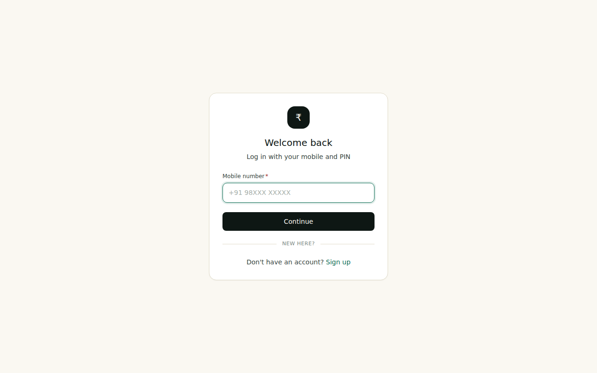
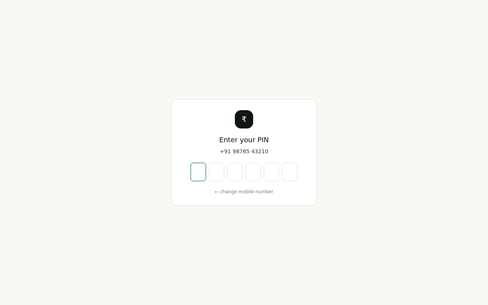
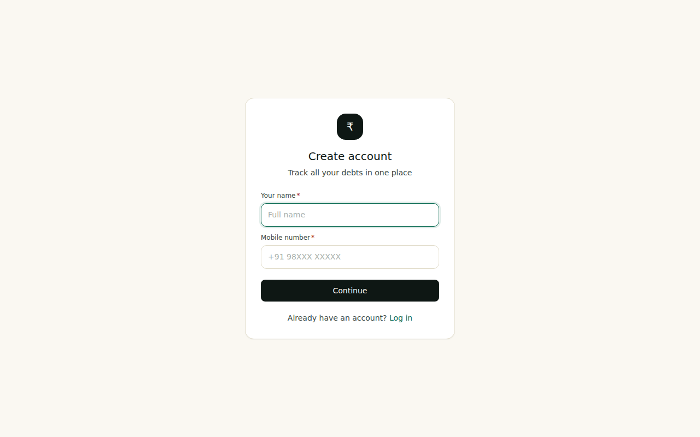
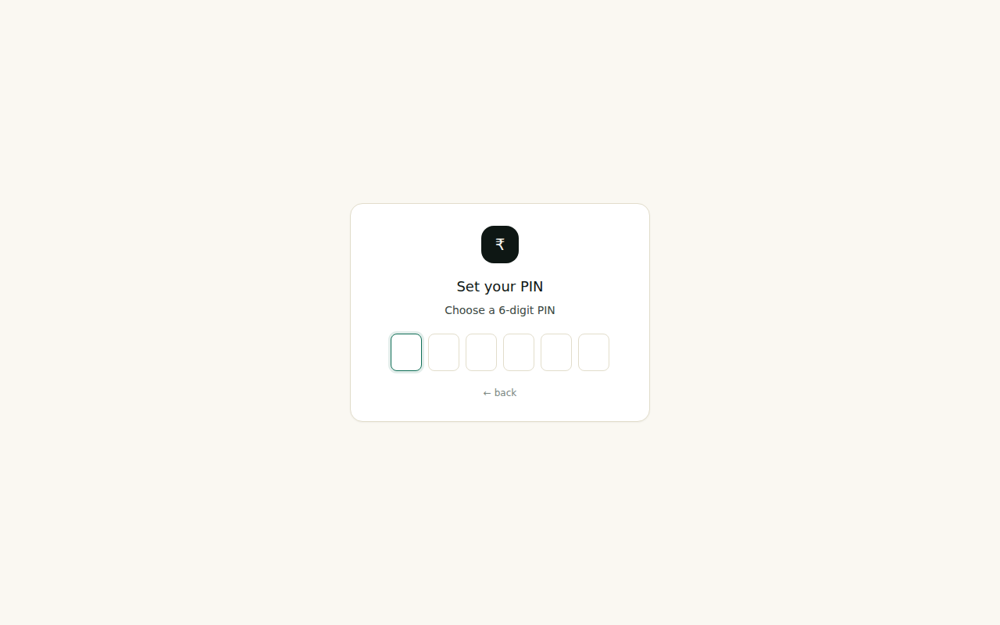
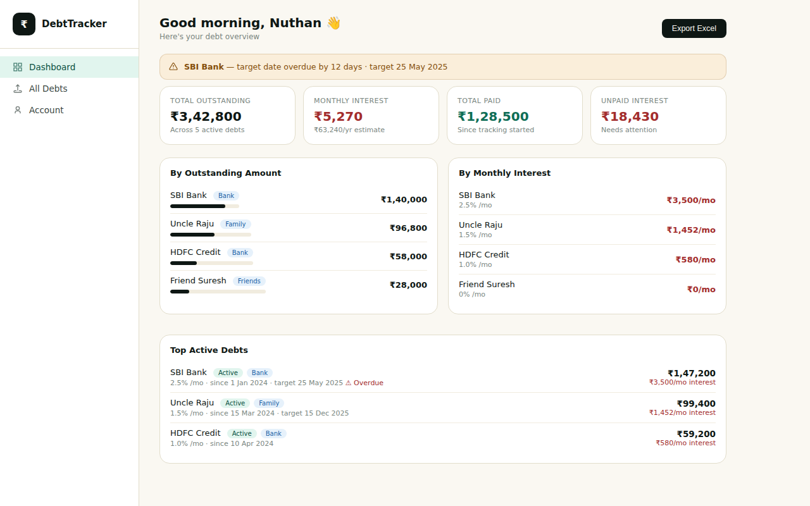
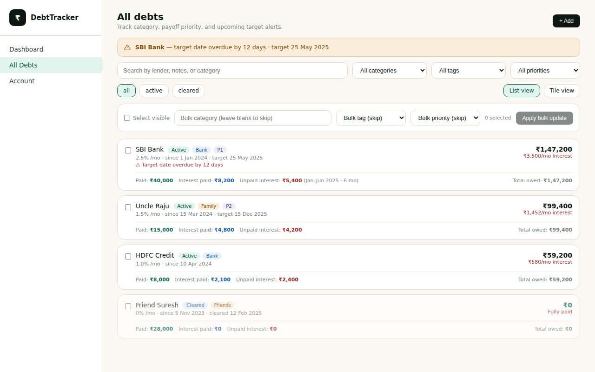
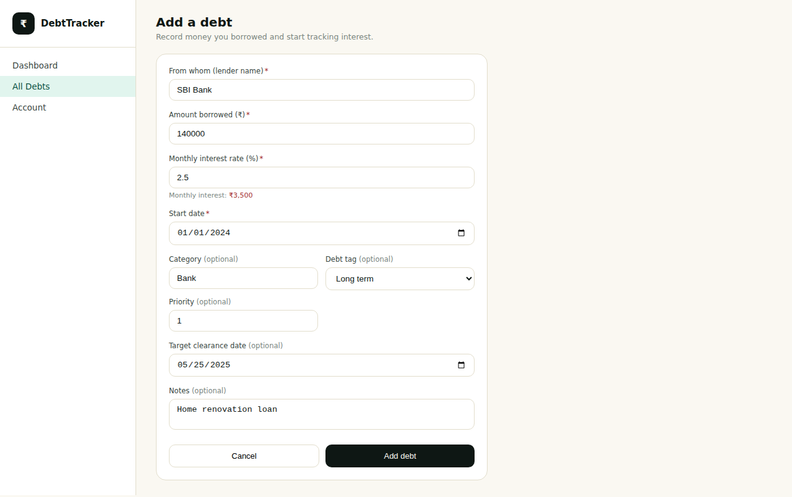
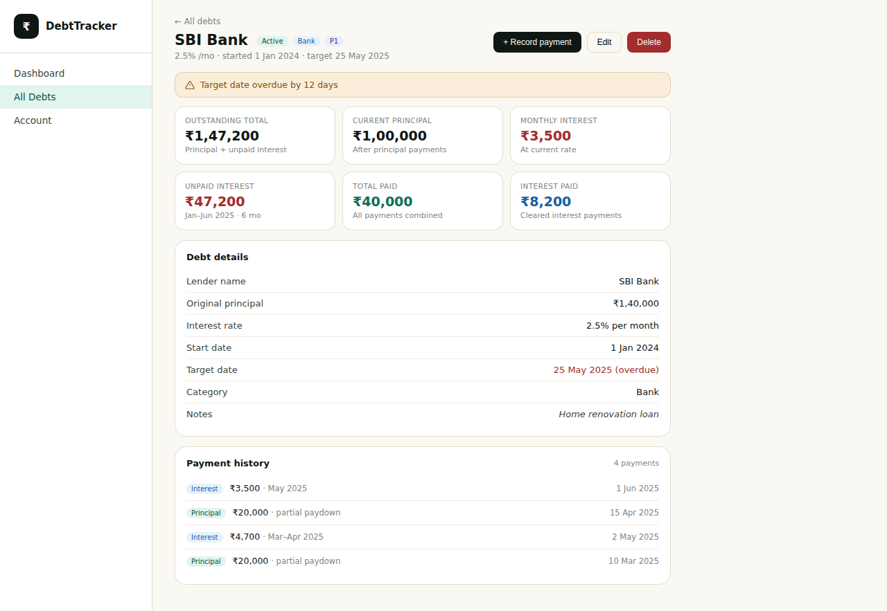
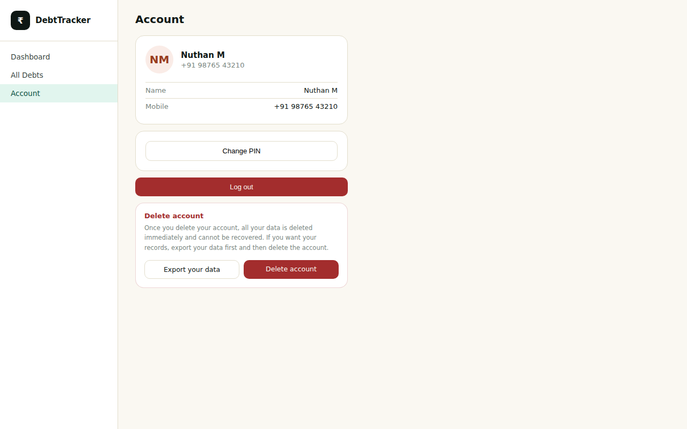

# mydebttracker

> **A personal debt-tracking web app** — record every rupee you've borrowed, watch interest accrue month by month, and stay on top of clearance targets.

---

## Table of Contents

1. [Overview](#overview)
2. [Screenshots](#screenshots)
3. [Application Flow](#application-flow)
4. [Features](#features)
5. [Tech Stack](#tech-stack)
6. [Database Schema](#database-schema)
7. [Getting Started](#getting-started)
8. [Environment Variables](#environment-variables)
9. [Project Structure](#project-structure)

---

## Overview

**mydebttracker** is a Next.js 14 (App Router) application that helps you manage debts you owe to banks, family members, or friends. It tracks the original principal, calculates compounding monthly interest, records partial payments, and alerts you when target clearance dates are approaching or overdue.

Authentication is mobile-number + 6-digit PIN — no email required.

---

## Screenshots

### Login


### Login – Enter PIN


### Sign Up


### Sign Up – Set PIN


### Dashboard


### All Debts


### Add a Debt


### Debt Detail


### Account


---

## Application Flow

```
┌─────────────┐
│  Visit app  │
└──────┬──────┘
       │
       ▼
 Logged in? ──No──► /login ──────────────────► Enter mobile number
       │                                              │
      Yes                                        Enter 6-digit PIN
       │                                              │
       ▼                                        POST /api/auth/login
   /home ◄──────────────────────────────────────────┘
(Dashboard)
       │
       ├──► /debts ─────────────────────────────────────────┐
       │    (All debts list)                                 │
       │         │                                           │
       │         ├──► /debts/new  (Add new debt)             │
       │         │         │                                 │
       │         │    POST /api/debts                        │
       │         │         │                                 │
       │         │         ▼                                 │
       │         └──► /debts/[id]  (Debt detail) ◄───────────┘
       │                   │
       │                   ├── View stats (outstanding, interest, paid)
       │                   ├── Record payment (interest / principal / clearance)
       │                   ├── Edit debt details
       │                   └── Delete debt
       │
       └──► /account
                 │
                 ├── View profile (name, mobile)
                 ├── Change PIN
                 ├── Export data (Excel)
                 └── Delete account
```

### Auth flow detail

```
Sign Up                               Log In
──────────────────                    ─────────────────────
1. Enter name + mobile                1. Enter mobile
2. Set 6-digit PIN                    2. Enter 6-digit PIN
3. Confirm PIN                        3. Session cookie set (30 days)
4. POST /api/auth/signup              4. Redirect to /home
5. Session cookie set
6. Redirect to /home
```

---

## Features

### Debt management
- **Add debts** with lender name, principal, monthly interest rate, start date, and optional target clearance date
- **Category** tagging (e.g. Bank, Family, Friends) for grouping and filtering
- **Instrument tag** — mark debts as Temp, Short term, or Long term
- **Priority** (P1–P10) to define payoff order
- **Notes** field for free-form context

### Interest tracking
- Monthly interest accrues **from the month after the start date**
- **Rate-change history** — if the rate changes over time, old months use the historical rate
- **Principal reduction** — partial principal payments reduce the base for future interest calculations
- Month-by-month breakdown of unpaid interest shown on each debt

### Payments
- Record three payment types:
  - **Interest payment** — clears accrued monthly interest
  - **Principal payment** — reduces the outstanding principal
  - **Clearance payment** — marks the debt as fully paid

### Dashboard & analytics
- Total outstanding, monthly interest burn, total paid, unpaid interest at a glance
- Bar charts: debts ranked by outstanding amount and by monthly interest cost
- Priority-grouped view for strategic payoff planning
- **Payment range analysis** — see cash outflow over any date range

### Alerts
- Overdue alert when today is past the target date
- Upcoming alert when the target date is within 30 days
- Alert banner on both the dashboard and debt detail pages

### Bulk operations
- Select multiple debts and update category, instrument tag, or priority in one action

### Exports
- Export full dashboard data to **Excel (.xlsx)** with multiple sheets:  
  summary, debts list, payment history, and outflow analysis

### Account
- Change PIN without losing session
- Export all data before deletion
- Permanently delete account and all associated data

---

## Tech Stack

| Layer | Technology |
|---|---|
| Framework | Next.js 14 (App Router) |
| Language | JavaScript (no TypeScript) |
| Styling | Tailwind CSS 3 + custom utility classes |
| Font | Plus Jakarta Sans (Google Fonts) |
| Database | Neon PostgreSQL (serverless) via `@neondatabase/serverless` |
| Auth | Mobile + 6-digit PIN (`bcryptjs` for hashing, HTTP-only session cookie) |
| Export | `xlsx` library |
| Deployment | Any Node.js host (Vercel recommended) |

---

## Database Schema

```sql
-- Users
users (id, name, mobile UNIQUE, pin_hash, created_at)

-- Sessions (cookie-based auth)
sessions (id, token UNIQUE, user_id → users, expires_at)

-- Debts
debts (
  id, user_id → users,
  lender_name, principal, current_principal,
  interest_rate, start_date, target_date,
  status (active|cleared), category,
  instrument_tag (temp|short_term|long_term),
  priority, notes, created_at
)

-- Rate change history (for variable-rate debts)
debt_rate_changes (id, debt_id → debts, effective_month, rate, created_at)

-- Payments
debt_payments (
  id, debt_id → debts,
  amount, payment_date,
  payment_type (interest|principal|clearance),
  note, created_at
)
```

---

## Getting Started

### Prerequisites

- Node.js 18+
- A free [Neon](https://neon.tech) PostgreSQL database

### 1. Clone & install

```bash
git clone https://github.com/nuthanm/mydebttracker.git
cd mydebttracker
npm install
```

### 2. Set up the database

Create a Neon project at [console.neon.tech](https://console.neon.tech), then run the schema:

```bash
psql "$DATABASE_URL" -f db/schema.sql
```

### 3. Configure environment

```bash
cp .env.example .env.local
# Edit .env.local and paste your Neon connection string
```

### 4. Run the development server

```bash
npm run dev
```

Open [http://localhost:3000](http://localhost:3000) and sign up for a new account.

### 5. Build for production

```bash
npm run build
npm start
```

---

## Environment Variables

| Variable | Description |
|---|---|
| `DATABASE_URL` | Neon PostgreSQL pooled connection string (`******host/db?sslmode=require`) |

---

## Project Structure

```
mydebttracker/
├── app/                    # Next.js App Router pages & API routes
│   ├── login/              # Login page (mobile + PIN)
│   ├── signup/             # Sign-up page
│   ├── home/               # Dashboard
│   ├── debts/              # Debts list, new debt form, debt detail
│   ├── account/            # Account settings
│   └── api/                # REST API routes
│       ├── auth/           #   login, logout, signup
│       ├── debts/          #   CRUD + payment recording
│       └── account/        #   PIN change, delete account
├── components/             # Shared UI components (Shell, PinInput, Toast, ConfirmDialog)
├── db/
│   └── schema.sql          # Full database schema
├── lib/                    # Utility modules
│   ├── auth.js             # Session helpers, PIN hash/verify
│   ├── db.js               # Neon SQL client
│   ├── debtInterest.js     # Month-by-month interest calculation engine
│   ├── export.js           # Excel export builder
│   └── format.js           # Currency, date formatters
├── docs/
│   └── screenshots/        # App screenshots used in this README
├── .env.example            # Environment variable template
└── tailwind.config.js      # Custom design tokens (colors, fonts)
```
